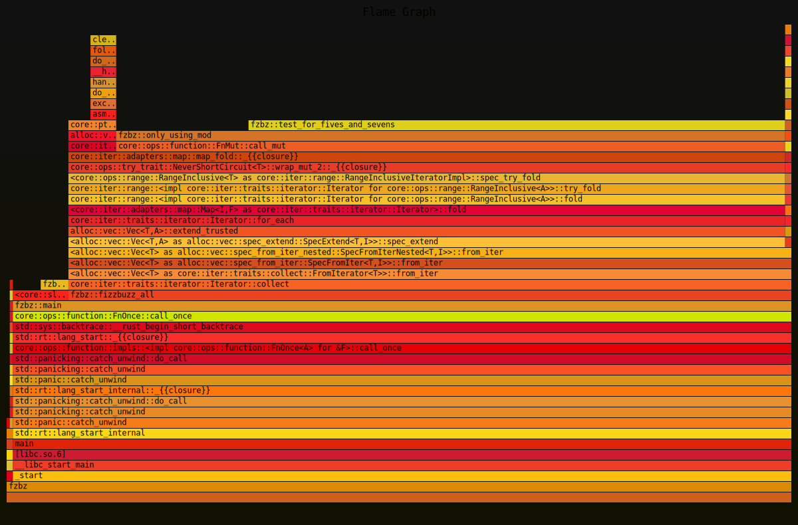

# Fizz buzz with some Divan

## About

I recently watched [Andy Balaam's FizzBuzz video] where he implemented a
version of Fizz buzz in Rust in a test-driven manner, and then tries a few
changes to make the implementation more pleasing and possibly more performant.

Throughout, Andy does stress that it's not a good idea to spend time on
performance tuning without actually checking. This got me thinking how I had
wanted to learn about [Divan] for benchmarking in Rust, so I decided to
separate out the major revisions of Andy's implementation and try benchmarking
them.

[Andy Balaam's FizzBuzz video]:
  https://video.infosec.exchange/w/2dEHo81R7ozrfohX2PARWt
[Divan]: https://github.com/nvzqz/divan

### Please note

- I'm a novice at Rust and at benchmarking and I've never actually used Divan
  before.
- I do realise that this isn't a great candidate for a benchmarking effort
  because it's so simple. I was more interested in learning how to use the
  Divan crate. Nevertheless, there were some surprises.

### Best to read the article (after watching the video)

There's [a blog post] discussing all this further; this source repository is
mainly for reference for that post, and this file just to briefly explain
what's here. [See the post for a fuller picture].

[a blog post]:
  https://strugglers.net/posts/2026/rusty-fizzbuzz-with-some-divan/
[See the post for a fuller picture]:
  https://strugglers.net/posts/2026/rusty-fizzbuzz-with-some-divan/

## Usage

There isn't much to actually use directly as a program here. Once compiled
with `cargo run` it'll do this brand of Fizz buzz up to 2 million with one of
the implementations and then print out a summary:

```txt
$ cargo run
   Compiling fzbz v0.1.0 (/home/andy/src/fzbz)
    Finished `dev` profile [unoptimized + debuginfo] target(s) in 0.08s
     Running `target/debug/fzbz`
Fizzbuzz(2000000) resulted in:
        Buzz:     517827 (25.9%)
        Fizz:     551569 (27.6%)
        FizzBuzz: 537389 (26.9%)
        Number:   393215 (19.7%)
```

## Implementations

To understand how the implementations came about it would be best to watch
Andy's video first, but briefly: each major modification he made to his Fizz
buzz function is represented as a different function in `src/lib.rs`. The
implementations are listed in the order that their changes are discussed in
Andy's video.

After some benchmarking I added one new implementation in two variants. All
implementations can be run through a set of unit tests that you'll find in
`src/main.rs`, using `cargo test`.

## Benchmarking

The Divan crate is used to provide benchmarking insight. The benchmarks are
defined in `benchmarks/fizzbuzz.rs`; it's just a benchmark function for each
implementation that again does a Fizz buzz up to 2 million.

Run `cargo benchmark` to do this on your own machine. On my 8 year old rather
slow desktop (Intel(R) Core(TM) i7-8700 CPU @ 3.20GHz) I get:

```
Timer precision: 12 ns
fizzbuzz                                    fastest       │ slowest       │ median        │ mean          │ samples │ iters
├─ early_return_before_mod_bench            53.56 ms      │ 65.34 ms      │ 54.2 ms       │ 54.66 ms      │ 100     │ 100
├─ mod_then_match_bench                     56.45 ms      │ 60.22 ms      │ 57.23 ms      │ 57.38 ms      │ 100     │ 100
├─ naive_bench                              59.62 ms      │ 63.31 ms      │ 60.16 ms      │ 60.33 ms      │ 100     │ 100
├─ only_using_mod_bench                     22.85 ms      │ 24.3 ms       │ 23.23 ms      │ 23.32 ms      │ 100     │ 100
├─ only_using_mod_with_early_return_bench   14.27 ms      │ 15.59 ms      │ 14.51 ms      │ 14.59 ms      │ 100     │ 100
├─ single_string_scan_bench                 59.59 ms      │ 64.17 ms      │ 60.3 ms       │ 60.48 ms      │ 100     │ 100
╰─ single_string_scan_early_fizzbuzz_bench  56.86 ms      │ 59.98 ms      │ 57.65 ms      │ 57.81 ms      │ 100     │ 100
```

On a bit newer machine I have at home (AMD Ryzen 9 7900 12-Core Processor) I
get:

```
Timer precision: 10 ns
fizzbuzz                                    fastest       │ slowest       │ median        │ mean          │ samples │ iters
├─ early_return_before_mod_bench            30.6 ms       │ 42.58 ms      │ 30.93 ms      │ 32.37 ms      │ 100     │ 100
├─ mod_then_match_bench                     28.09 ms      │ 32.54 ms      │ 28.94 ms      │ 28.97 ms      │ 100     │ 100
├─ naive_bench                              29.44 ms      │ 31.55 ms      │ 30.11 ms      │ 30.14 ms      │ 100     │ 100
├─ only_using_mod_bench                     11.63 ms      │ 12.1 ms       │ 11.64 ms      │ 11.67 ms      │ 100     │ 100
├─ only_using_mod_with_early_return_bench   8.274 ms      │ 9.495 ms      │ 8.492 ms      │ 8.786 ms      │ 100     │ 100
├─ single_string_scan_bench                 31.63 ms      │ 50.32 ms      │ 31.83 ms      │ 32.62 ms      │ 100     │ 100
╰─ single_string_scan_early_fizzbuzz_bench  31.28 ms      │ 32.26 ms      │ 31.53 ms      │ 31.54 ms      │ 100     │ 100
```

All of the implementations are currently single threaded so will only use one
CPU core.

## Flame graphs

After benchmarking the implementations from the video I decided to try
generating a flame graph. This was very easily done with:

```txt
$ cargo install flamegraph
$ CARGO_PROFILE_RELEASE_DEBUG=true cargo flamegraph
$ sed -i 's/eeeeee/111111/g; s/eeeeb0/111100/g' flamegraph.svg
```

(The `sed` is because I have some vision difficulties and prefer a dark
background.)

In the `flamegraphs/` directory you'll find flame graphs of three of the
implementations.

Try opening each raw SVG file in your browser to benefit from hover text on
each function's cell.

### `mod_then_match`


### `only_using_mod`



### `only_using_mod_with_early_return`


## License

Since almost all of the implementations are from a [CC BY-SA] video by Andy
Balaam then this repository probably should be as well. I'm not sure that what
little I have added is actually copyrightable being mostly scaffold, comments
and test/benchmarking harness, but if it is then it also probably should be
licensed CC BY-SA.

[CC BY-SA]: https://creativecommons.org/licenses/by-sa/4.0/
